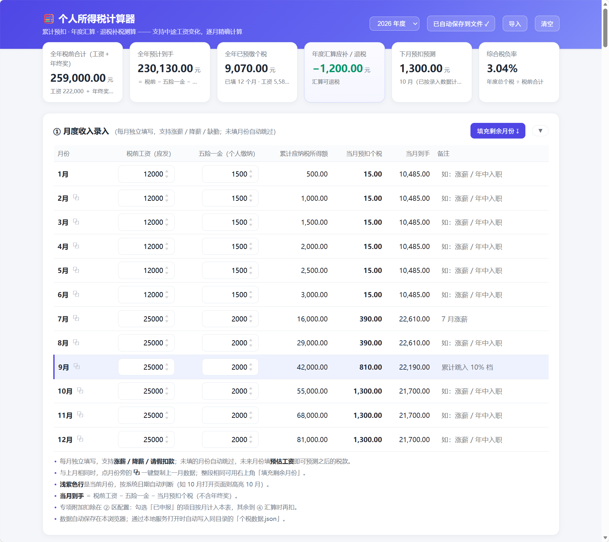
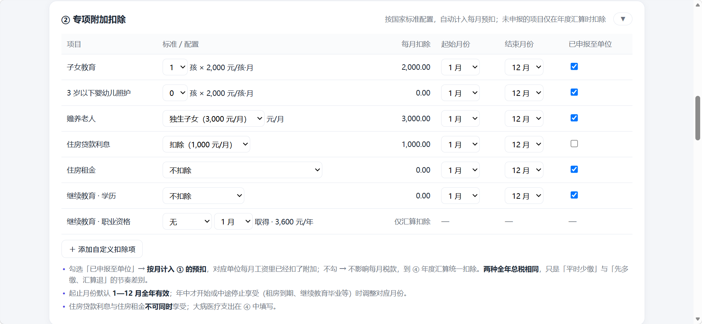
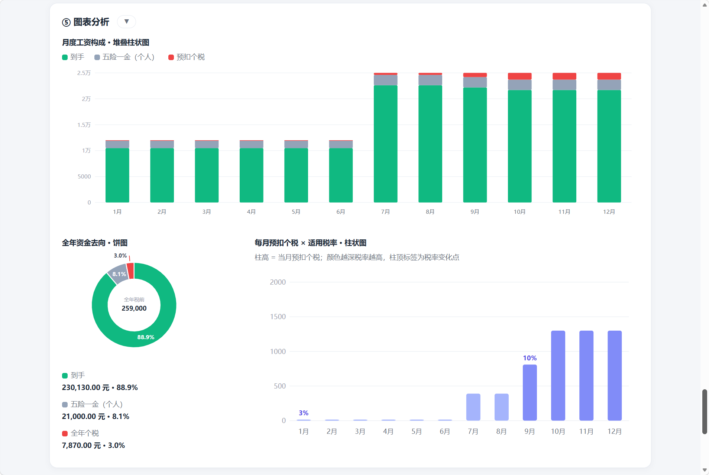

# 🧮 个人所得税计算器

一个**纯本地、单文件**的个税计算网页：按税局申报系统同款的**累计预扣法**逐月精确计算，天然支持**中途涨薪 / 降薪 / 请假扣款**等工资变化场景，并覆盖**年度汇算退税补税测算**与**年终奖计税方式对比**。

双击 [index.html](./index.html) 即可使用——无需安装、无需联网、数据不出本机。

## ✨ 功能特性

- **逐月录入**：12 个月独立填写工资与五险一金，支持任意月变化；未填月份自动跳过
- **累计预扣法**：与单位申报口径一致，税率跳档月份清晰可见
- **下月预测**：当前月 + 未来预估月，提前知道下个月扣多少税（「填充剩余月份」一键生成）
- **年度汇算**：退税 / 补税实时测算，含年中离职退税、免办汇算提示
- **专项附加扣除**：子女教育、婴幼儿照护、赡养老人、房贷 / 租金、继续教育等按国家标准配置，支持起止月份、申报开关
- **年终奖**：单独计税 vs 并入综合所得自动对比择优，「多发少得」盲区自动提醒
- **图表分析**：月度工资构成、全年资金去向饼图、每月税额 × 适用税率柱状图
- **多年度**：2019 — 次年，各年度数据独立保存
- **数据安全**：localStorage 自动保存；可选自动同步为 JSON 文件；支持导入

## 🚀 快速开始

获取（任选其一）：

- `git clone https://github.com/isPirate/tax-calculator.git`
- 仓库页 **Code → Download ZIP**，解压
- 只下载 [index.html](./index.html)：文件页点 **Raw** → `Ctrl+S`，单文件即可完整使用

运行：

| 方式     | 操作                                         | 数据保存                                                                     |
| -------- | -------------------------------------------- | ---------------------------------------------------------------------------- |
| 直接打开 | 双击 `index.html`（Edge / Chrome 最佳）      | 存浏览器本地；点顶部「自动保存到文件」绑定 JSON 后，每次改动自动写入该文件    |
| 本地服务 | `node serve.cjs`，访问 http://127.0.0.1:8791 | 每次变更自动写入同目录「个税数据.json」                                      |

## 📸 界面导览

### ① 总览与月度录入

顶部汇总卡片实时显示全年税前 / 到手 / 已预缴 / 汇算应补退 / 下月预测 / 税负率；① 区逐月录入，浅紫色行为当前月份。



### ② 专项附加扣除

按国家标准配置各项额度与起止月份；勾选「已申报至单位」的按月计入预扣，未勾选的只在年度汇算扣除——**两种方式全年总税相同**，只是预缴节奏不同。



### ③ 年终奖

自动对比「单独计税 / 并入综合所得」并推荐更省者；手动锁定较贵方式时会给出多缴金额警告；落入盲区（如 36,000 ~ 38,566.67 元）时提醒「多发反而少得」。


### ④ 年度汇算

退税（绿）/ 补税（红）实时测算，含专项附加、大病医疗等扣除项与免办汇算提示。注意：即使只工作了几个月，基本减除费用仍按全年 60,000 计算——这是年中离职常产生退税的原因。


### ⑤ 图表分析

月度工资构成堆叠柱、全年资金去向饼图（环形 + 图上百分比 + 中心总额）、每月预扣个税 × 适用税率柱状图（颜色深浅 = 税率高低，柱顶标注税率跳变点）。



## 📖 使用要点

| 场景                     | 做法                                                                                |
| ------------------------ | ----------------------------------------------------------------------------------- |
| 中途涨薪 / 降薪          | 直接在对应月份填新工资，后续月份自动按新累计计算                                    |
| 与上月工资相同           | 点月份旁的**⧉** 一键复制上一月数据；整段相同用「填充剩余月份」                     |
| 预测下月税款             | 未来月份填预估工资，或点「填充剩余月份」按最近月份生成                              |
| 全年没在单位申报附加扣除 | ② 区各项不勾「已申报」，月度税即与工资条一致，扣除在汇算体现                       |
| 年终奖跨年               | 按**实际发放年度**填写：2025 年度的奖金 2026 年发放 → 填 2026 年度           |
| 单位已单独预扣过奖金个税 | 填入 ③ 区「发放时已预扣个税」（个税 APP 中该笔的「已申报税额」），避免重复算成补税 |

## 💾 数据与隐私

- 所有数据仅保存在**本机浏览器**（localStorage），不上传任何服务器
- 经本地服务打开时自动同步到 `个税数据.json`；双击模式下可用顶部「自动保存到文件」绑定一个 JSON 文件（Chromium 系浏览器）
- 「导入」支持恢复备份 JSON；每个年度独立存储、互不影响

## 🛠 开发与测试

- 计算引擎为纯函数，内嵌于 index.html（`__ENGINE_START__` / `__ENGINE_END__` 标记）
- `test-engine.mjs` 从页面提取引擎代码运行 **68 个验证用例**（涨薪跳档、年终奖盲区、退税场景、边界输入等）：

```bash
node test-engine.mjs   # 68 通过，0 失败
```

## ⚠️ 说明

计算结果供参考，实际以**个人所得税 APP** 及主管税务机关核定为准。税率政策口径：起征点 5,000 元/月（60,000 元/年），七级超额累进 3% — 45%；年终奖单独计税政策执行至 2027 年底。
